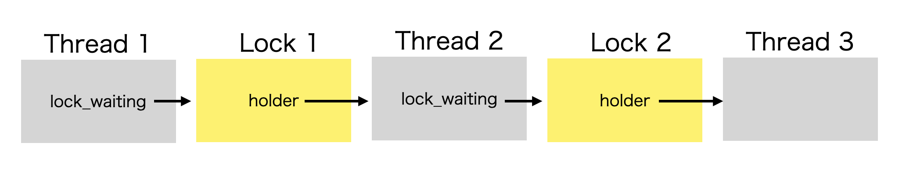

# Project 1: Threads

## Preliminaries

>Fill in your name and email address.

Hibiki Ashitani <goma.pyra@gmail.com>

>If you have any preliminary comments on your submission, notes for the
>TAs, please give them here.


>Please cite any offline or online sources you consulted while
>preparing your submission, other than the Pintos documentation, course
>text, lecture notes, and course staff.

- https://ja.wikipedia.org/wiki/%E3%83%A9%E3%82%A6%E3%83%B3%E3%83%89%E3%83%AD%E3%83%93%E3%83%B3%E3%83%BB%E3%82%B9%E3%82%B1%E3%82%B8%E3%83%A5%E3%83%BC%E3%83%AA%E3%83%B3%E3%82%B0

## Alarm Clock

#### DATA STRUCTURES

>A1: Copy here the declaration of each new or changed struct or struct member, global or static variable, typedef, or enumeration.  Identify the purpose of each in 25 words or less.

thread構造体に、
- 今sleep状態にあるかどうか
- いつsleepかつBLOCKEDの状態からRUNNING状態になるべきか
の情報を保持させた。

```c
// thread.h

struct thread {
  /* Owned by thread.c. */
  tid_t tid;                 /**< Thread identifier. */
  enum thread_status status; /**< Thread state. */
  char name[16];             /**< Name (for debugging purposes). */
  uint8_t *stack;            /**< Saved stack pointer. */
  int priority;              /**< Priority. */
  struct list_elem allelem;  /**< List element for all threads list. */
  bool sleeping;
  int64_t sleep_until;       /**< sleepから起こす時刻 */

  /* Shared between thread.c and synch.c. */
  struct list_elem elem; /**< List element. */

#ifdef USERPROG
  /* Owned by userprog/process.c. */
  uint32_t *pagedir; /**< Page directory. */
#endif

  /* Owned by thread.c. */
  unsigned magic; /**< Detects stack overflow. */
};

```


#### ALGORITHMS

>A2: Briefly describe what happens in a call to timer_sleep(),
>including the effects of the timer interrupt handler.

timer_sleep()は、新設したフラグsleeping及びsleep_untilを設定した上で自身をBLOCKED状態にする。
timer interrupt handlerは、sleeping=trueであるthreadで、sleep_untilが現在の時刻より過去のものすべてをRUNNING状態にする。


>A3: What steps are taken to minimize the amount of time spent in
>the timer interrupt handler?

実装のシンプルさを優先して高速化を行っていない。単に全threadの走査をしている。
実際にはsleep中のthreadをすべて保持するリストを作成し、sleepからreadyにするべき時刻順にソートしてthread構造体を入れておくなどの工夫が有効だと考えられる。

#### SYNCHRONIZATION

>A4: How are race conditions avoided when multiple threads call
>timer_sleep() simultaneously?

timer_sleep()の実行中に割り込みを禁止している。

>A5: How are race conditions avoided when a timer interrupt occurs
>during a call to timer_sleep()?

timer_sleep()の実行中に割り込みを禁止している。

#### RATIONALE

>A6: Why did you choose this design?  In what ways is it superior to
>another design you considered?

threadのリストを新設せず、すでに実装されているthread_foreachを使い回すことでコードの変更を最小限にとどめた点で優れていると考える。

## Priority Scheduling

#### DATA STRUCTURES

>B1: Copy here the declaration of each new or changed struct or struct member, global or static variable, typedef, or enumeration.  Identify the purpose of each in 25 words or less.

thread構造体にlock_waitingとlocks_heldを追加した。またpriorityとbase_priorityを分けて保持するようにした。
lockをacquireしたりreleaseするたびに優先度を再計算できるようにするためである。

```c
// thread.h
struct thread {
  /* Owned by thread.c. */
  tid_t tid;                 /**< Thread identifier. */
  enum thread_status status; /**< Thread state. */
  char name[16];             /**< Name (for debugging purposes). */
  uint8_t *stack;            /**< Saved stack pointer. */
  int priority;              /**< donationを考慮した優先度 */
  int base_priority;         /**< 優先度 */
  struct list_elem allelem;  /**< List element for all threads list. */
  bool sleeping;
  int64_t sleep_until;       /**< sleepから起こす時刻 */

  struct lock *lock_waiting; /**< 待っているlock */
  struct list locks_held;    /**< 握っているlock */

  /* Shared between thread.c and synch.c. */
  struct list_elem elem; /**< List element. */

#ifdef USERPROG
  /* Owned by userprog/process.c. */
  uint32_t *pagedir; /**< Page directory. */
#endif

  /* Owned by thread.c. */
  unsigned magic; /**< Detects stack overflow. */
};
```

```c
// synch.h
struct lock {
  struct thread *holder;      /**< Thread holding lock (for debugging). */
  struct semaphore semaphore; /**< Binary semaphore controlling access. */
  struct list_elem elem;      /**< locks_held用 */
};
```

>B2: Explain the data structure used to track priority donation.
>Use ASCII art to diagram a nested donation.  (Alternately, submit a
>.png file.)

各threadは自身が待つlockへのポインタを保持し、各lockは自身を握っているthreadへのポインタを保持する。これはnested donationへの対応をするためである。
さらに各threadは自身が握っているlockへのポインタのlistを保持し、そのために各lockはlist_elemを保持している、これはmultiple donationへの対応をするためである。



#### ALGORITHMS

>B3: How do you ensure that the highest priority thread waiting for
>a lock, semaphore, or condition variable wakes up first?

ready_list, sema_waiters等を優先度でソートしておく。

>B4: Describe the sequence of events when a call to lock_acquire()
>causes a priority donation.  How is nested donation handled?

lock_acquire()を呼び出したスレッド、その待っているlockを握っているスレッド、その待っているlockを握っているスレッドと辿っていき、それぞれに対して優先度をmax(もともとの優先度, lock_acquire()を呼び出したスレッドの優先度)としていくことでnested priority donationを実現している。

>B5: Describe the sequence of events when lock_release() is called
>on a lock that a higher-priority thread is waiting for.

lock_release()を呼び出したスレッドをtとする。
まずtのlocks_heldからロックを消去する。
tの待っているlockを握っているスレッドと順番に辿っていき、それぞれに対して優先度を計算し直す。この際、以前のpriority donationがなくなって各スレッドの優先度が落ちることがある。
その状態でsema_upが呼ばれる。内部のyield_if_low_priority()は実行中のスレッドより優先度の高いスレッドが存在する場合にyieldするので、yieldが発生する。
結果として、高優先度のスレッドに処理が戻る。

#### SYNCHRONIZATION

>B6: Describe a potential race in thread_set_priority() and explain
>how your implementation avoids it.  Can you use a lock to avoid
>this race?


base_priorityを更新してからupdate_priority_donation()を行うまでの間に割り込みが発生してしまうと、ロックを握ったスレッドの優先度が低いままになってしまうと考えられる。
しかし、本実装では上記タイミングでの割り込みを禁止しているのでその心配はない。

ロックを使ってこの競合状態を避けることはできない。仮にロックをつかって実装したとする。ここで使うロックをlock2とする。また優先度の高いスレッドH、低いLを考える。Hがlock1を待ち、Lがlock1を握っているとする。Lの優先度はpriority donationによってHと等しくなっている。実行中のスレッドはLとする。
ここでthread_set_priority()を呼んでLの優先度を低くすることを考える。優先度の再計算のためにLがlock2を握る。しかし再計算が始まる前に割り込みが入ってスレッドがHに切り替わり、Hがまたthread_set_priority()を呼んだとする。lock2は現在優先度が低く設定されたままになっているLが握っている。一方Hはlock2を待たないと優先度再計算ができない。これはデッドロックである。

#### RATIONALE

>B7: Why did you choose this design?  In what ways is it superior to
>another design you considered?

優先度の再計算をある程度一つの関数にまとめておくことで可読性を担保した。

## Advanced Scheduler

#### DATA STRUCTURES

>C1: Copy here the declaration of each new or changed struct or struct member, global or static variable, typedef, or enumeration.  Identify the purpose of each in 25 words or less.


#### ALGORITHMS

>C2: How is the way you divided the cost of scheduling between code
>inside and outside interrupt context likely to affect performance?


#### RATIONALE

>C3: Briefly critique your design, pointing out advantages and
>disadvantages in your design choices.  If you were to have extra
>time to work on this part of the project, how might you choose to
>refine or improve your design?


>C4: The assignment explains arithmetic for fixed-point math in
>detail, but it leaves it open to you to implement it.  Why did you
>decide to implement it the way you did?  If you created an
>abstraction layer for fixed-point math, that is, an abstract data
>type and/or a set of functions or macros to manipulate fixed-point
>numbers, why did you do so?  If not, why not?